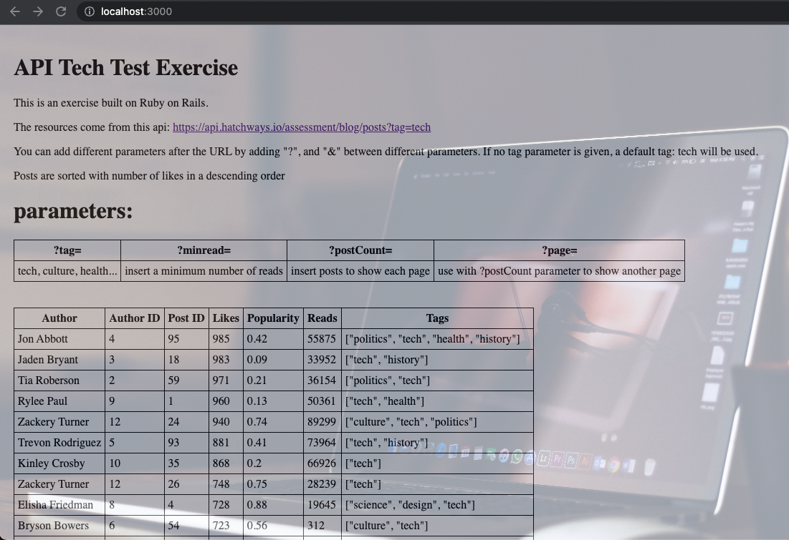

# Mock Blog Post Server

This is a tech test exercise to the [question](./question.md) here. This server receives requests from client and fetches data using an external API.  

I used Ruby on Rails also as a practice of this framework. This exercise was completed in roughly one day.

## User Stories

As a reader,  
so that I can read posts that interest me,  
I want to filter posts with tags  

As a reader,  
so that I can read posts that are most liked,  
I want the posts with descending number of likes  

As a reader,  
so that I can read the most popular posts,  
I want only posts more than a certain number of read to show  

As a reader,  
so that I can read posts without slowing down my machine,  
I want the posts to be shown in pages, each showing a number of posts, eg 10 posts.  


## Approach
I chose Ruby on Rails because I want to try it out.  

I first built the backend of the program, I first hardcode the api URL and ```puts``` the response to the console, just to make sure I can get the information.  After I can get a correct response, I used Postman to send http request to the backend to confirm my routing is correct. Also in the process I studied the type of each objects in the whole communication so that I can decide what functions I might be using in later stages.  

After I am sure communication can go through from front end to back end, to the external api and back, then I started to implement the different functionalities.  

Tag is the first parameter I implemented because it involves only manipulation of incoming requests and its String. After tag parameter is finished, I added the functionality of sorting with like numbers, then filtering with read numbers, as they increase in complexity. Lastly I implemented the pagination.  

While the backend was being built, I also added a page in the frontend to show the result. I first just to show the response from the backend to make sure the data could pass through. After I confirmed the communication could go through, I put the received data into a table for easier viewing. Lastly I added some simple formatting and a backgroudn image.

## Installation and Running the server
To install, first clone the git and install all dependencies:
```
git clone https://github.com/michaelcychan/posts-api.git
cd posts-api
gem install

bin/rails server
```
The termainal will now start the server  
  
### Features
Use your browser to open http://localhost:3000  



If no tag parameter is given, a default tag: tech will be used. Different parameters can be added after ```http://localhost:3000/?```  

Each parameter should be separated by ```&```

```?tag=```tech, health, culture...   
posts will be filtered with tag   
   
```?minread=```
posts will be filtered with the minimum number of read

```?postCount=```
only a certain number of posts is shown, if further posts is required, add ```?page=```

Example: ```?tag=history&postCount=5&page=3```   
